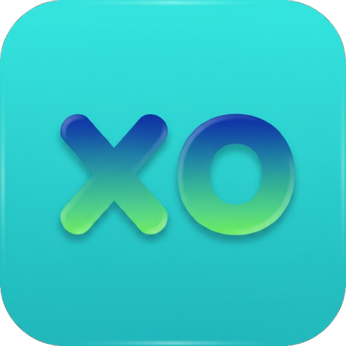
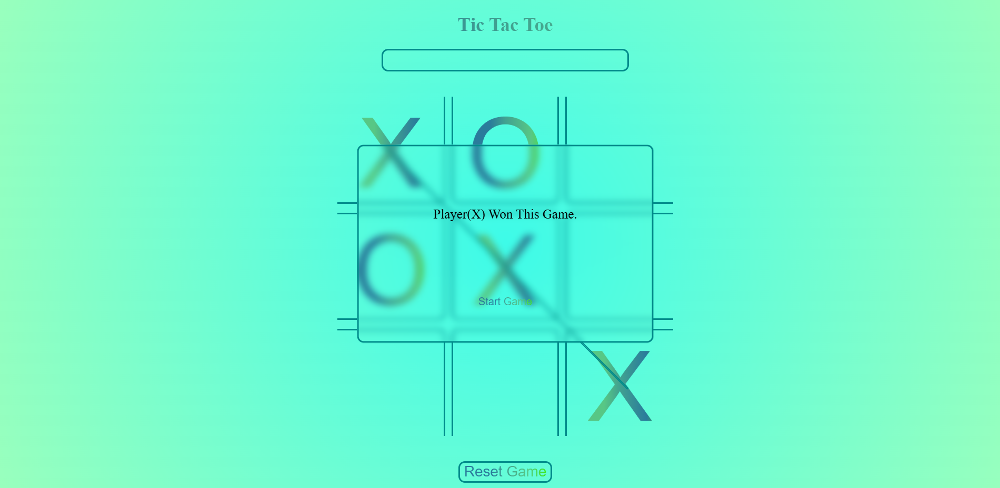

<div align="center">
  

  # Tic Tac Toe

  ### A sleek, animated 2-Player Tic Tac Toe game — pure HTML, CSS & JavaScript

  [](https://developer.mozilla.org/en-US/docs/Web/HTML)
  [](https://developer.mozilla.org/en-US/docs/Web/CSS)
  [](https://developer.mozilla.org/en-US/docs/Web/JavaScript)
  [](LICENSE)

  [](https://github.com/maheerCodes/Tic-Tac-Toe/stargazers)
  [](https://github.com/maheerCodes/Tic-Tac-Toe/network/members)
  [](https://github.com/maheerCodes/Tic-Tac-Toe/issues)
  [](https://github.com/maheerCodes/Tic-Tac-Toe/commits/main)

  No frameworks. No libraries. Just clean vanilla code, gradient text, glassmorphism popups, sound effects, and a custom full-page reload transition.

  **[🌐 Live Demo](https://maheercodes.github.io/Tic-Tac-Toe/)** · **[🐛 Report Bug](https://github.com/maheerCodes/Tic-Tac-Toe/issues)** · **[✨ Request Feature](https://github.com/maheerCodes/Tic-Tac-Toe/issues)**
</div>

<br>

<div align="center">
  
</div>

<br>

## 📑 Table of Contents

- [Features](#-features)
- [Tech Stack](#️-tech-stack)
- [Browser Support](#-browser-support)
- [Project Structure](#-project-structure)
- [Getting Started](#-getting-started)
- [How to Play](#️-how-to-play)
- [How It Works](#️-how-it-works-code-overview)
- [Customization](#-customization)
- [FAQ](#-faq)
- [Roadmap](#️-roadmap--future-improvements)
- [Contributing](#-contributing)
- [License](#-license)
- [Author](#-author)

## ✨ Features

| | |
|---|---|
| 🎲 | **Random starting player** — X or O is randomly chosen at the start of every game |
| 🧠 | **Smart win detection** across all 8 winning patterns (rows, columns, diagonals) |
| 📏 | **Animated win-line** that draws itself across the winning combination |
| 🪟 | **Glassmorphism popups** for Win & Draw states with backdrop blur |
| 🔊 | **Sound effects** — click sound on every move, game-over sound on win/draw |
| 🌀 | **Custom reload animation** — a 3-layer color-wipe transition on title click |
| 🔄 | **One-click Reset** button to restart anytime |
| 🌈 | **Gradient-styled UI** using CSS `background-clip: text` |
| 📱 | **Fully responsive** layout built with `vmin` units |

## 🛠️ Tech Stack

| Layer | Technology |
|---|---|
| Structure | HTML5 |
| Styling | CSS3 — Custom Properties, Flexbox, Keyframe Animations, `backdrop-filter` |
| Logic | Vanilla JavaScript — DOM manipulation, Event Listeners |
| Audio | HTML5 Audio API |

## 🌍 Browser Support

| Chrome | Firefox | Edge | Safari |
|:---:|:---:|:---:|:---:|
| ✅ | ✅ | ✅ | ⚠️ Requires `-webkit-backdrop-filter` (already included) |

> 💡 **Note:** Built with modern CSS (`backdrop-filter`, custom properties) — use a recent browser version for the full glassmorphism effect.

## 📁 Project Structure

```text
Tic-Tac-Toe/
├── index.html                               # Main markup & game board
├── style.css                                # Core layout, board, gradient text, buttons
├── won.css                                  # "Win" popup styling
├── draw.css                                 # "Draw" popup styling
├── reloadAnimation.css                      # Full-page reload transition animation
├── script.js                                # Game logic (moves, win/draw detection, reset)
├── clickSound.mp3                           # Sound played on each box click
├── gameOverSound.mp3                        # Sound played on win/draw
├── Image.png                                # Preview image
├── LICENSE                                  # MIT License
└── wmremove-transformed-removebg-preview.svg # Favicon / logo
```

## 🚀 Getting Started

No build tools or dependencies required.

### 1. Clone the repository


```bash
git clone https://github.com/maheerCodes/Tic-Tac-Toe.git
cd Tic-Tac-Toe
```

**2. Open it in your browser**

Simply double-click `index.html`, **or** serve it locally for the best experience (recommended, since some browsers restrict audio on `file://` paths):

```bash
npx serve .
```

or use the **Live Server** extension in VS Code.

## 🕹️ How to Play

1. On load, the game randomly decides whether **Player X** or **Player O** goes first.
2. Players take turns clicking empty boxes on the 3×3 grid.
3. The first player to align **three of their marks** — horizontally, vertically, or diagonally — wins.
4. A win triggers an animated line across the winning combination and a **Win** popup.
5. If all 9 boxes fill up with no winner, a **Draw** popup appears.
6. Click **Start Game** in the popup, or **Reset Game**, to play again.
7. Click the **"Tic Tac Toe"** title anytime to trigger a full-page reload animation.

## ⚙️ How It Works (Code Overview)

<details>
<summary>Click to expand the function breakdown</summary>
<br>

| Function | Responsibility |
|---|---|
| `matchWinningPattern()` | Loops through 8 predefined winning patterns, compares the three relevant boxes, and if matched, renders the win-line, plays the game-over sound, and locks the board |
| `matchDrawnPattern()` | Checks if every box is filled with no winner, and shows the Draw popup if so |
| `animation1()` | Clears the board and plays a 3-layer CSS keyframe transition before calling `location.reload()` |
| Box click listener | Alternates the current player, updates the turn indicator & gradient class, plays the click sound, disables the box, then checks for win/draw |
| Restart handlers (`#stg1`, `#stg2`, `#reset-button`) | Reset board state, re-enable boxes, hide popups, and restore the turn indicator |

</details>

## 🎨 Customization

All colors are driven by CSS custom properties — re-theming is easy. Edit the `:root` block in `style.css`, `won.css`, and `draw.css`:

```css
:root {
    --borderColor: rgb(0, 139, 139);
    --textGradientFirstColor: rgba(42, 123, 155, 1);
    --textGradientSecondColor: rgba(65, 161, 144, 1);
    --textGradientThirdColor: rgba(87, 199, 133, 1);
    --textGradientForthColor: rgba(56, 240, 0, 1);
    --backgroundImageCenterColor: rgba(63, 251, 235, 1);
    --backgroundImageOutsideColor: rgba(153, 255, 189, 1);
}
```

To swap sound effects, replace `clickSound.mp3` and `gameOverSound.mp3` with your own files (keep the same filenames, or update the paths in `script.js`).

## ❓ FAQ

<details>
<summary><b>Can I play against a computer/AI?</b></summary>
<br>
Not yet — currently it's 2-player only (same device). An AI opponent using the Minimax algorithm is on the roadmap.
</details>

<details>
<summary><b>The sound isn't playing — why?</b></summary>
<br>
Some browsers block audio when opening files directly via <code>file://</code>. Serve the project locally (e.g. <code>npx serve .</code> or VS Code's Live Server) instead of double-clicking <code>index.html</code>.
</details>

<details>
<summary><b>Why does clicking the title reload the whole page?</b></summary>
<br>
It's an intentional Easter egg — it plays a 3-layer color-wipe transition (<code>animation1()</code> in <code>script.js</code>) and then refreshes the board for a fresh start.
</details>

## 🗺️ Roadmap / Future Improvements

- [ ] Single-player mode vs. an AI opponent (Minimax algorithm)
- [ ] Scoreboard to track wins across multiple rounds
- [ ] Mute/unmute toggle for sound effects
- [ ] Dark mode theme
- [ ] Touch/mobile gesture polish

## 🤝 Contributing

Contributions, issues, and feature requests are welcome!

1. Fork the project
2. Create your feature branch (`git checkout -b feature/amazing-feature`)
3. Commit your changes (`git commit -m 'Add some amazing feature'`)
4. Push to the branch (`git push origin feature/amazing-feature`)
5. Open a Pull Request

## 📄 License

This project is licensed under the **MIT License** — see the [LICENSE](LICENSE) file for details.

## 👤 Author

**Maheer**

[](https://github.com/maheerCodes)

<div align="center">
  <br>

  ### ⭐ If you liked this project, consider giving it a star!

  Made with ❤️ using HTML, CSS & JavaScript
</div>